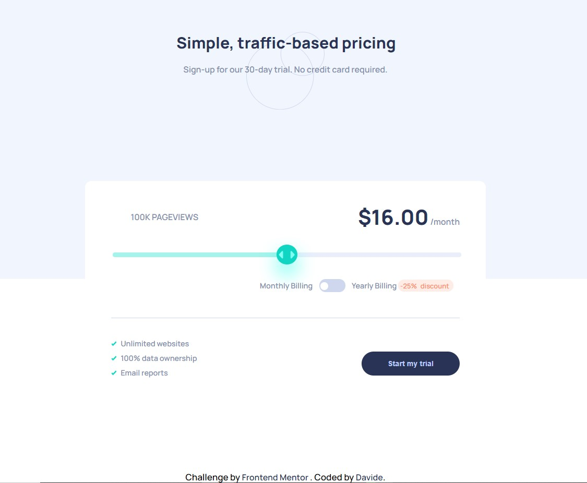

# Frontend Mentor - Interactive pricing component

This is a solution to the [Interactive pricing component challenge on Frontend Mentor](https://www.frontendmentor.io/challenges/interactive-pricing-component-t0m8PIyY8). Frontend Mentor challenges help you improve your coding skills by building realistic projects. 

## Table of contents

  - [The challenge](#the-challenge)
  - [Screenshot](#screenshot)
  - [Links](#links)
  - [Built with](#built-with)
  - [What I learned](#what-i-learned)
  - [Continued development](#continued-development)
- [Author](#author)
- [Acknowledgments](#acknowledgments)

## Overview

### The challenge

Users should be able to:

- View the optimal layout for the app depending on their device's screen size
- See hover states for all interactive elements on the page
- Use the slider and toggle to see prices for different page view numbers

### Screenshot

### Links

- [View live page here](https://interactive-pricing-component-git-master-da-vi-de.vercel.app/)

### Built with

- Semantic HTML5 markup
- CSS custom properties
- Flexbox
- Vanilla Javascript

### What I learned

Although this is a simple layout, i've never dealt with slider range bars and switch checkboxes, it took me
some time to implement the design correctly.
Afterwards i challenged myself by rewriting JS solution because i was repeating the same code 
(in the beginning i did everything with if/else staments), so i figure out the best way to avoid WET code was 
using switch cases, it wasn't staightforward, nothing was working as expected, eventually i realized the switch couldn't 
read percentage values.

### Continued development

Definetely i need to practice more responsive web design.

## Author

- Frontend Mentor - [@Da-vi-de](https://www.frontendmentor.io/profile/Da-vi-de)

## Acknowledgments

Thanks to [W3schools](https://www.w3schools.com/) for the slider range bar and the switch checkbox.